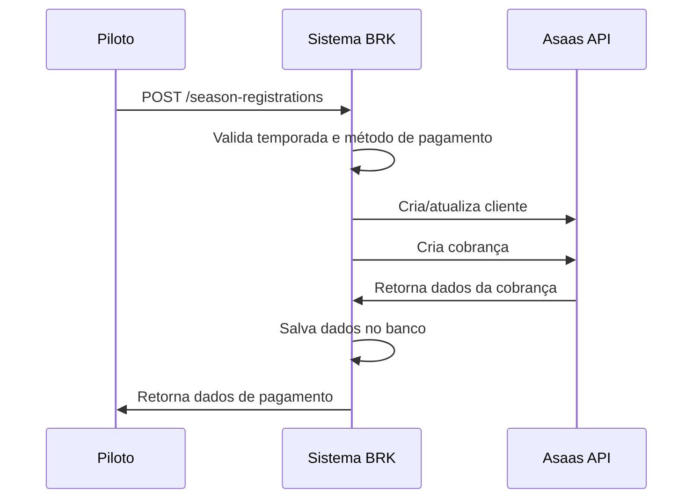
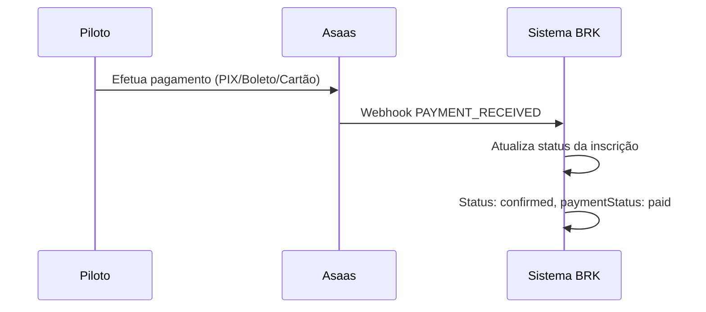

# Integração com Asaas - Sistema de Pagamentos BRK

## Visão Geral

Este documento descreve a integração do sistema BRK com a API de pagamentos da Asaas, permitindo que pilotos se inscrevam em temporadas e efetuem pagamentos de forma segura e automatizada.

## Funcionalidades Implementadas

### 1. **Criação de Inscrições com Pagamento**
- Permite que pilotos se inscrevam em temporadas específicas
- Cria automaticamente cobrança no Asaas
- Suporte a múltiplos métodos de pagamento (Boleto, PIX, Cartão de Crédito/Débito)
- Validação de métodos aceitos por temporada

### 2. **Processamento de Webhooks**
- Recebe notificações em tempo real da Asaas
- Atualiza automaticamente status de pagamentos e inscrições
- Logs detalhados para auditoria

### 3. **Gestão de Clientes**
- Criação/atualização automática de clientes no Asaas
- Sincronização de dados entre sistemas

### 4. **Suporte a PIX**
- Geração automática de QR Code
- Copy/paste do código PIX

## Configuração

### Variáveis de Ambiente

Adicione as seguintes variáveis ao seu arquivo `.env`:

```env
# Configuração da Asaas
ASAAS_API_URL=https://sandbox.asaas.com/api/v3  # Para produção: https://asaas.com/api/v3
ASAAS_API_KEY=sua-api-key-aqui
ASAAS_WEBHOOK_URL=https://seudominio.com/api/webhooks/asaas
```

### Configuração do Webhook na Asaas

1. Acesse sua conta Asaas
2. Vá em **Configurações > Webhooks**
3. Adicione um novo webhook com:
   - **URL**: `{ASAAS_WEBHOOK_URL}` (definida nas variáveis de ambiente)
   - **Eventos**: Marque todos os eventos relacionados a pagamentos
   - **Versão**: v3

## Endpoints da API

### Inscrições em Temporadas

#### **POST /season-registrations**
Cria uma nova inscrição em temporada com pagamento.

**Request Body:**
```json
{
  "seasonId": "uuid-da-temporada",
  "paymentMethod": "pix", // boleto, pix, cartao_credito, cartao_debito
  "userDocument": "12345678900" // CPF opcional
}
```

**Response:**
```json
{
  "message": "Inscrição criada com sucesso",
  "data": {
    "registration": {
      "id": "uuid-da-inscricao",
      "userId": "uuid-do-usuario",
      "seasonId": "uuid-da-temporada",
      "status": "payment_pending",
      "paymentStatus": "pending",
      "amount": 150.00
    },
    "paymentData": {
      "registrationId": "uuid-da-inscricao",
      "billingType": "PIX",
      "value": 150.00,
      "dueDate": "2025-01-20",
      "invoiceUrl": "https://...",
      "pixQrCode": "data:image/png;base64,...",
      "pixCopyPaste": "00020126580014..."
    }
  }
}
```

#### **GET /season-registrations/my**
Lista as inscrições do usuário logado.

#### **GET /season-registrations/{id}**
Busca uma inscrição específica.

#### **GET /season-registrations/{id}/payment**
Busca dados de pagamento de uma inscrição.

#### **POST /season-registrations/{id}/cancel**
Cancela uma inscrição.

**Request Body:**
```json
{
  "reason": "Motivo do cancelamento"
}
```

### Webhooks

#### **POST /webhooks/asaas**
Endpoint para receber notificações da Asaas (configurado automaticamente).

#### **POST /webhooks/asaas/test**
Endpoint para teste de webhooks.

## Fluxo de Inscrição e Pagamento

### 1. **Criação da Inscrição**


### 2. **Processamento do Pagamento**


## Status de Inscrição

### **RegistrationStatus**
- `pending`: Inscrição criada, aguardando processamento
- `payment_pending`: Aguardando pagamento
- `confirmed`: Inscrição confirmada (pagamento aprovado)
- `cancelled`: Inscrição cancelada
- `expired`: Inscrição expirada (pagamento vencido)

### **PaymentStatus**
- `pending`: Pagamento pendente
- `processing`: Pagamento em processamento
- `paid`: Pagamento aprovado
- `failed`: Pagamento falhou
- `cancelled`: Pagamento cancelado
- `refunded`: Pagamento estornado

## Eventos de Webhook Tratados

- `PAYMENT_RECEIVED`: Pagamento recebido
- `PAYMENT_CONFIRMED`: Pagamento confirmado
- `PAYMENT_OVERDUE`: Pagamento vencido
- `PAYMENT_DELETED`: Pagamento cancelado
- `PAYMENT_REFUNDED`: Pagamento estornado

## Métodos de Pagamento Suportados

### **Boleto Bancário**
- Vencimento padrão: 7 dias após criação
- URL do boleto retornada na resposta

### **PIX**
- QR Code gerado automaticamente
- Código copy/paste disponível
- Pagamento instantâneo

### **Cartão de Crédito**
- Integração via tokenização
- Suporte a parcelamento (futuro)

### **Cartão de Débito**
- Pagamento instantâneo

## Logs e Monitoramento

### **Logs da Aplicação**
```
[ASAAS] POST /customers
[ASAAS] Response 200 from /customers
[WEBHOOK] Recebido webhook do Asaas: PAYMENT_RECEIVED
[WEBHOOK] Processado com sucesso: PAYMENT_RECEIVED para pagamento pay_123456
```

### **Dados Salvos para Auditoria**
- Resposta completa da API Asaas (`rawResponse`)
- Dados completos do webhook (`webhookData`)
- Timestamps de todas as operações

## Tratamento de Erros

### **Erros Comuns**
- **400**: Dados inválidos na requisição
- **404**: Temporada/inscrição não encontrada
- **403**: Sem permissão para acessar recurso
- **500**: Erro interno do servidor

### **Recuperação de Falhas**
- Webhooks são reprocessados automaticamente pela Asaas
- Logs detalhados permitem identificar e corrigir problemas
- Status podem ser corrigidos manualmente se necessário

## Segurança

### **Validação de Webhooks**
- Verificação de assinatura do webhook (implementação básica)
- Logs de tentativas de webhook inválidas

### **Autenticação**
- Todos os endpoints protegidos por JWT
- Verificação de permissões por usuário/role

### **Dados Sensíveis**
- API Key da Asaas protegida em variáveis de ambiente
- Dados de pagamento criptografados no banco

## Testes

### **Ambiente Sandbox**
- Use `https://sandbox.asaas.com/api/v3` para testes
- Crie uma conta sandbox na Asaas
- Configure webhooks para ambiente de teste

### **Comandos Úteis**
```bash
# Instalar dependências
npm install

# Executar migrations
npm run migration:run

# Iniciar aplicação
npm run dev
```

## Próximos Passos

### **Funcionalidades Futuras**
- [ ] Suporte a parcelamento de cartão de crédito
- [ ] Integração com split de pagamentos
- [ ] Dashboard de pagamentos para administradores
- [ ] Relatórios financeiros
- [ ] Integração com emissão de notas fiscais

### **Melhorias de Segurança**
- [ ] Implementação completa de validação de assinatura de webhook
- [ ] Rate limiting nos endpoints
- [ ] Criptografia adicional de dados sensíveis

## Suporte

Para dúvidas sobre a integração:
1. Consulte a [documentação oficial da Asaas](https://docs.asaas.com/)
2. Verifique os logs da aplicação
3. Teste usando o ambiente sandbox

## Exemplo de Uso Completo

```javascript
// 1. Criar inscrição
const response = await fetch('/season-registrations', {
  method: 'POST',
  headers: {
    'Content-Type': 'application/json',
    'Authorization': 'Bearer YOUR_JWT_TOKEN'
  },
  body: JSON.stringify({
    seasonId: 'season-uuid',
    paymentMethod: 'pix',
    userDocument: '12345678900'
  })
});

const { data } = await response.json();

// 2. Exibir dados de pagamento para o usuário
if (data.paymentData.billingType === 'PIX') {
  // Mostrar QR Code
  document.getElementById('qr-code').src = data.paymentData.pixQrCode;
  // Mostrar código copy/paste
  document.getElementById('pix-code').textContent = data.paymentData.pixCopyPaste;
}

// 3. Verificar status da inscrição
const checkStatus = async () => {
  const statusResponse = await fetch(`/season-registrations/${data.registration.id}`);
  const { data: registration } = await statusResponse.json();
  
  if (registration.status === 'confirmed') {
    alert('Pagamento confirmado! Inscrição realizada com sucesso.');
  }
};

// Verificar a cada 5 segundos
setInterval(checkStatus, 5000);
``` 